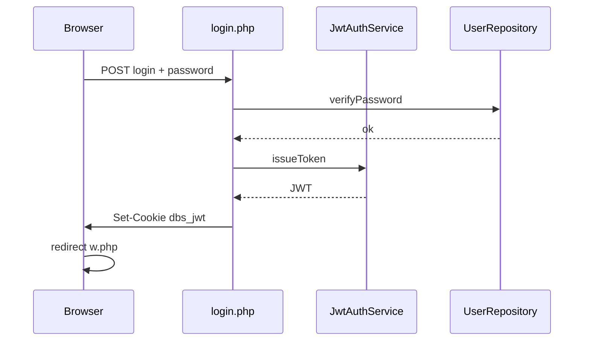

# Dbscript 4 — Architecture (arch-modern)

**Branch:** `arch-modern` · **Base:** `modern-ops`  
**Audience:** dj--alex and contributors evaluating a 2026-era PHP CMS layout.

Dbscript is **not deployed anywhere** on this fork path — no legacy migration. Fresh install writes UTF-8 TOML + `password_hash` only.

---

## 1. Layers

```
HTTP entry (thin PHP) → bootstrap.php → Application
    → Services (Editor, Reader, Admin, Auth)
    → Infrastructure (TOML, DBAL, Twig, JWT)
    → MySQL utf8mb4
```

| Layer | Location | Responsibility |
|-------|----------|----------------|
| Entry | `login.php`, `w.php`, `admin.php`, … | Request/response only |
| Application | `src/Dbscript/Application.php` | DI root, config access |
| Services | `src/Dbscript/Service/` | Business logic, API-ready |
| Infrastructure | `Config/`, `Auth/`, `Database/`, `View/` | TOML, JWT, DBAL, Twig |
| Bridge (temp) | `Http/GlobalBridge.php` | Legacy `$pr` until w/r split |

---

## 2. Configuration (TOML, UTF-8)

All configs live in `_conf/*.toml`. No csv, no `¦` delimiter, no numeric `$pr[n]` in new code.

| File | Purpose |
|------|---------|
| `property.toml` | Site flags, debug, CSRF, paths, MySQL host |
| `users.toml` | Logins with `password_hash` only |
| `secrets.toml` | `jwt_secret` (generated at install) |
| `sitedata.toml` | Welcome text, search labels, branding |
| `dbdata.toml` | Table registry for editor/reader |
| `pages.toml` | Page metadata |
| `styles.toml` | Theme variables (CSS custom properties) |
| `langset.toml` | Active languages |
| `denywords.toml` | SQL denylist |
| `files.toml` | Upload allowlist |

Examples: [`deploy/toml/`](deploy/toml/).

Optional future: `[storage] users = "mysql"` in `property.toml` → Doctrine entity for users.

---

## 3. Authentication

- **Only** `password_hash()` / `password_verify()` — no `hashgen`, no md5(md5), no bcrypt dual-mode.
- Session carrier: **JWT** in httpOnly cookie **`dbs_jwt`** (not `dbsa`).
- Claims: `sub` (login), `role`, `iat`, `exp`.
- Cookie: `HttpOnly`, `SameSite=Lax`, `Secure` when HTTPS.
- CSRF on mutating POST via `CsrfService` + hidden `_csrf` (enabled by default in `property.toml`).

### Login flow



---

## 4. EditorService — API-ready contract (v1)

Controllers and future REST handlers call **only** these methods. No SQL in entry PHP.

| Method | Future REST | Replaces in legacy `w.php` |
|--------|-------------|----------------------------|
| `listTables(): TableMeta[]` | `GET /api/v1/tables` | tbl picker from dbdata |
| `listRows(tableId, ListQuery): Page` | `GET /api/v1/tables/{id}/rows` | list + pagination |
| `getRow(tableId, pk): Row` | `GET /api/v1/tables/{id}/rows/{pk}` | edit form |
| `createRow(tableId, RowData): pk` | `POST /api/v1/tables/{id}/rows` | KEY_ADD |
| `updateRow(tableId, pk, RowData): void` | `PUT ...` | KEY_EDIT |
| `deleteRows(tableId, pk[]): int` | `DELETE ...` | KEY_DEL / mass delete |
| `executeSql(query, context): Result` | `POST /api/v1/sql/execute` | KEY_EXECUTE + denywords |
| `getColumnMeta(tableId): ColumnMeta[]` | `GET /api/v1/tables/{id}/columns` | column metadata |

`ReaderService` mirrors this for `r.php` (search, view, export).

**Rule:** add `src/Dbscript/Http/Api/` later without rewriting services.

---

## 5. Database

- **Editor/reader:** Doctrine DBAL + table metadata from `dbdata.toml` (dynamic SQL, not ORM entities).
- **System tables (optional):** Doctrine ORM for audit log, future MySQL-backed users.
- Charset: **utf8mb4** end-to-end.

---

## 6. Views

- Twig templates in `templates/` (layouts, editor, admin).
- Lang strings in `_langdb/*.toml` (UTF-8).
- Static CSS: `public/css/app.css` + variables from `styles.toml`.

Legacy `_templates/*.php` removed in final phase.

---

## 7. Removed in arch-modern

| Legacy | Replacement |
|--------|-------------|
| `dbscore.lib` | `src/Dbscript/*` |
| `*.cfg` csv | `*.toml` |
| Cookie `dbsa` | Cookie `dbs_jwt` |
| `hashgen` / md5 passwords | `password_hash` |
| CP1251 sources | UTF-8 |
| `$pr[n]` magic indices | named TOML fields + typed accessors |

---

## 8. Verification

```bash
composer install
vendor/bin/phpunit --testsuite unit
docker compose -f dev/docker-compose.yml up -d --build
docker compose exec web bash scripts/smoke-all.sh http://127.0.0.1
```

CI: `.github/workflows/arch-modern-ci.yml`

Handoff (RU): [`_langdb/.archive/arch-modern-2026/handoff-djalex.ru.md`](_langdb/.archive/arch-modern-2026/handoff-djalex.ru.md)

---

## 9. Non-goals (this branch)

- React / SPA frontend
- Full REST `/api/v1` implementation (contract only)
- Migration from production csv installs
- Changes to dj--alex license model
