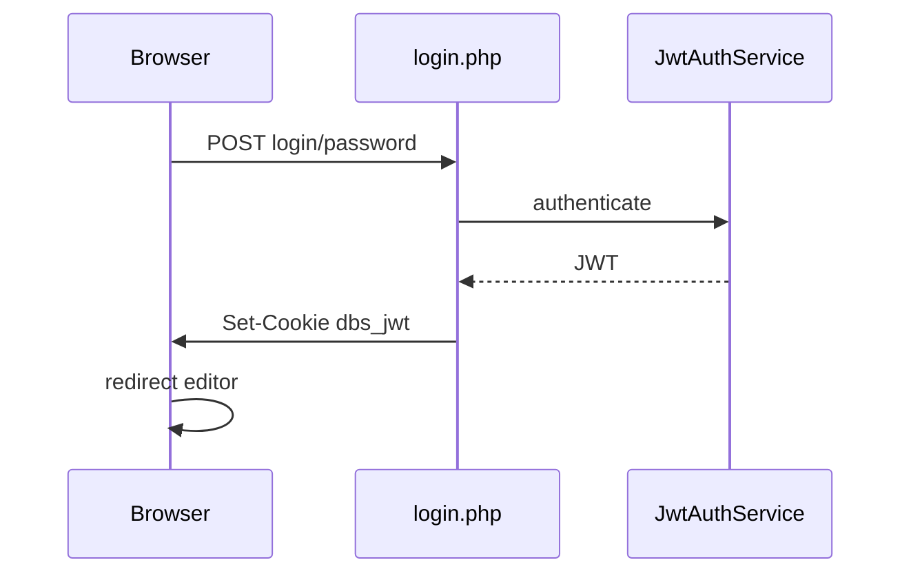

# Dbscript 4 — handoff ветки `arch-modern`

**Для:** dj--alex  
**От:** форк [shvshnkr/db-script](https://github.com/shvshnkr/db-script), ветка **`arch-modern`** (база — **`modern-ops`**)  
**Дата:** 2026-06-07  
**Статус:** фаза 7 — SQL/denywords + CSV export; legacy `dbscore.lib`/`*.cfg` пока параллельно

> Файл в `_langdb/.archive/` — служебная папка, **не участвует** в работе CMS.

См. предыдущие handoff: [`modern-ops-2026`](../modern-ops-2026/handoff-djalex.ru.md), [`php8-port-2026`](../php8-port-2026/handoff-djalex.ru.md).

---

## 1. Зачем эта ветка

Dbscript **нигде не используется** в prod на этом форке. Ветка **`arch-modern`** — **предложение новой архитектуры** для автора, без обратной совместимости с csv/`dbscore.lib`/`dbsa`.

| Цель | Решение |
|------|---------|
| Читаемая структура кода | PSR-4 `src/Dbscript/` вместо монолита `dbscore.lib` |
| Понятные конфиги | TOML UTF-8 вместо csv с `¦` и `$pr[n]` |
| Современная auth | JWT `dbs_jwt` + `password_hash` only |
| API-ready editor | `EditorService` → будущий REST без переписывания логики |
| SSR UI 2026 | Twig + UTF-8 lang |

**Не prod-миграция.** Установка с нуля пишет только TOML.

---

## 2. Отличия от modern-ops

| Область | modern-ops | arch-modern |
|---------|------------|-------------|
| Ядро | `dbscore.lib` | `src/Dbscript/*` |
| Конфиги | `*.cfg` csv | `*.toml` |
| Cookie | `dbsa` (dual-mode) | `dbs_jwt` (JWT) |
| Пароли | hashgen / md5 / bcrypt | `password_hash` only |
| Шаблоны | `_templates/*.php` | Twig `templates/` |
| Кодировка | CP1251 legacy | UTF-8 |

Сохранено из modern-ops: Docker, smoke-оркестратор, `dbs-servicectl.sh`, идеи CSRF.

---

## 3. Карта `src/Dbscript/`

| Модуль | Назначение |
|--------|------------|
| `Application.php` | Boot, config access |
| `Config/` | TomlLoader, ConfigRepository, UserRepository |
| `Auth/` | JwtAuthService, CsrfService |
| `Service/` | EditorService, ReaderService (API-ready) |
| `Install/` | InstallWriter — fresh TOML install |
| `Http/GlobalBridge.php` | Временный мост `$pr` для w/r (удаляется) |
| `View/TwigRenderer.php` | Twig SSR |

Полная схема: [`ARCHITECTURE.md`](../../../ARCHITECTURE.md).

---

## 4. TOML schemas (примеры)

`property.toml`:

```toml
[site]
version = "4.5"
charset = "utf-8"

[security]
csrf_enabled = true

[mysql]
default_host = "127.0.0.1"
```

`users.toml`:

```toml
[[users]]
login = "admin"
password_hash = "$2y$12$..."
role = "admin"
active = true
```

`secrets.toml` (генерируется install, не коммитить):

```toml
jwt_secret = "64_hex_chars..."
```

Примеры: [`deploy/toml/`](../../../deploy/toml/).

---

## 5. JWT flow



---

## 6. EditorService → future REST

| Метод | REST (planned) |
|-------|----------------|
| `listTables()` | `GET /api/v1/tables` |
| `listRows()` | `GET /api/v1/tables/{id}/rows` |
| `getRow()` | `GET /api/v1/tables/{id}/rows/{pk}` |
| `createRow()` | `POST ...` |
| `updateRow()` | `PUT ...` |
| `deleteRows()` | `DELETE ...` |
| `executeSql()` | `POST /api/v1/sql/execute` |
| `ReaderService::export()` | CSV download |

### denywords.toml

```toml
words = ["drop", "truncate"]
# или с уровнем (legacy plevel):
# [[words]]
# word = "truncate"
# min_level = 4
```

Built-in block: `information_schema`, `mysql`, `grant`.

---

## 7. Что будет удалено (финальные фазы)

- `dbscore.lib`
- `_conf/*.cfg`, `_templates/*.php`
- cookie `dbsa`, `hashgen`, `csvopen`
- CP1251 в исходниках

---

## 8. Как проверить

```bash
git checkout arch-modern
composer install
vendor/bin/phpunit --testsuite unit
docker compose -f dev/docker-compose.yml up -d --build
docker compose exec web bash -c 'php scripts/arch-modern-install-dev.php testpass12 && php scripts/arch-modern-seed-demo.php && vendor/bin/phpunit --testsuite unit && bash scripts/smoke-arch-modern.sh http://127.0.0.1'
# legacy full gate (parallel):
docker compose exec web bash scripts/smoke-all.sh http://127.0.0.1
```

### arch-modern URLs (JWT + TOML)

| Entry | Назначение |
|-------|------------|
| `install-arch.php` | Fresh install → `_conf/*.toml` |
| `login-arch.php` | JWT login |
| `w-arch.php` | Editor: list + CRUD |
| `r-arch.php` | Reader: search + view |
| `admin-arch.php` | Admin panel |

Legacy (`w.php`, `r.php`, `dbscore.lib`, `*.cfg`) **не удалены** — работают параллельно до финального cutover.

CI: `.github/workflows/arch-modern-ci.yml`

---

## 9. Non-goals

- React / SPA
- Полный REST `/api/v1` (только контракт)
- Миграция legacy `.cfg` установок

---

## 10. Лицензия

Модель dj--alex не меняется. Ветка — неофициальный форк для демонстрации архитектуры.
