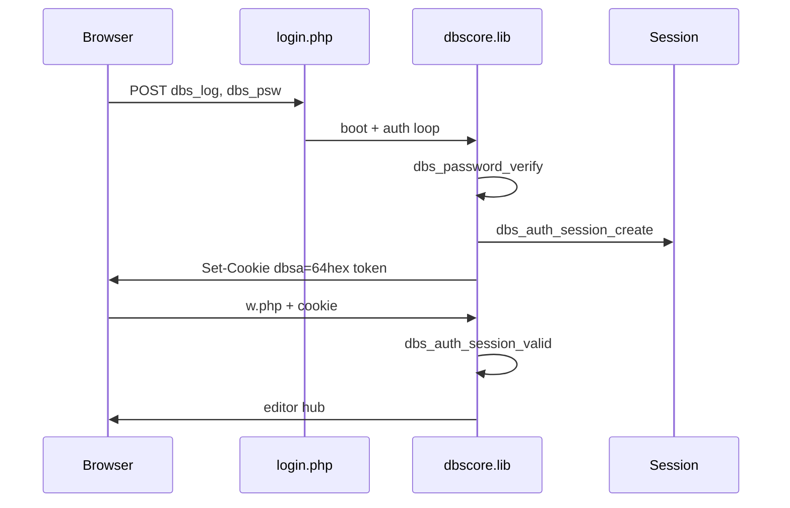

# Dbscript 4 — handoff ветки `modern-ops`

**Для:** dj--alex  
**От:** форк [shvshnkr/db-script](https://github.com/shvshnkr/db-script), ветка **`modern-ops`** (база — **`php8-port`**)  
**Дата:** 2026-06-07  
**Проверено:** PHP **8.2** (Docker), smoke-all skip-install + PHPUnit 53 unit / 1 integration — **green**

> Файл лежит в `_langdb/.archive/` — служебная папка, **не участвует** в работе CMS.  
> Путь в репозитории: [`_langdb/.archive/modern-ops-2026/handoff-djalex.ru.md`](../../.archive/modern-ops-2026/handoff-djalex.ru.md)

См. также предыдущий handoff порта PHP 8: [`_langdb/.archive/php8-port-2026/handoff-djalex.ru.md`](../php8-port-2026/handoff-djalex.ru.md).

---

## 1. Зачем эта ветка

`modern-ops` — **не переписывание** Dbscript. Это слой **эксплуатации и hardening** поверх уже рабочего `php8-port`:

| Цель | Решение |
|------|---------|
| Перезапуск Apache/MySQL на Ubuntu/Debian без `/etc/init.d/*` | `scripts/dbs-servicectl.sh` + блок SU в `admin.php` |
| Защита mutating POST | CSRF (`_csrf`, сессия) |
| Постепенный уход от «сырых» SQL/string cookie | helpers `dbs_escape_*`, `dbs_editor_insert`, session-auth |
| Prod gate без ручного клика | smoke-all + PHPUnit + GHA `modern-ops-ci.yml` |

**Не менялось намеренно:** csv-конфиги, `$pr` / `$prauth`, cookie-имя `dbsa`, лицензия, CP1251 исходников, архитектура «глобалы + dbscore.lib».

---

## 2. Карта изменений по файлам

### 2.1. Ядро `dbscore.lib`

#### Аутентификация и cookie `dbsa`

**Было:** cookie `dbsa` = `base64(login¦password)` — пароль в браузере.

**Стало (dual-mode):**

1. **Legacy cookie** — старый base64 по-прежнему принимается; при успешном входе выполняется **миграция** на session-token.
2. **Session token** — 64 hex-символа в cookie; в `$_SESSION['dbs_auth']` хранятся `user`, `token`, `iat`. Пароль в cookie **не** кладётся.

| Функция | Назначение |
|---------|------------|
| `dbs_auth_session_create($user, $expires)` | новый token + `session_regenerate_id` + cookie |
| `dbs_auth_session_valid($token)` | `hash_equals` с сессией |
| `dbs_auth_session_user($token)` | login из сессии |
| `dbs_auth_session_clear()` | logout / `resetcookie` |
| `dbs_auth_cookie_is_legacy($cookie)` | отличить base64 от token |
| `dbs_auth_restore_legacy_cookie($cookie)` | разбор legacy → `PHP_AUTH_*` |
| `dbs_password_verify($plain, $stored)` | md5(md5), hashgen **или** bcrypt/argon |
| `dbs_password_hash($plain)` | `password_hash()` для новых паролей |
| `dbs_password_needs_rehash($stored)` | миграция при смене пароля в admin |
| `dbs_setcookie_dbsa($value, $expires)` | HttpOnly, SameSite=Lax, Secure на HTTPS |
| `dbs_require_basic_auth()` | замена copy-paste authenticate-блоков |
| `dbs_reject_adm_override()` | блок подмены `ADM` из GET/POST/cookie |
| `dbs_lock_adm()` | восстановление `$ADM` после extract |

**Обслуживание:** новые entry-точки с POST — вызывать `dbs_lock_adm()` **после** `require dbscore.lib`, **до** логики; не дублировать `extract()` если ядро уже загружено через `initalize.php`.

#### CSRF

| Функция | Назначение |
|---------|------------|
| `dbs_csrf_enabled()` | по умолчанию **вкл**; opt-out: `pr[77]=on` (DIS_CSRF) |
| `dbs_csrf_token()` / `dbs_csrf_verify()` | token в `$_SESSION['dbs_csrf']` |
| `dbs_require_csrf()` | для POST entry-файлов |
| `csrfkey()` | hidden `_csrf` в формах (в т.ч. `submitkey`) |

**Где подключено:** `admin.php`, `w.php`, `wx.php`, `filemgr.php`, … — см. `dbs_require_csrf()` в entry.

#### Servicectl

| Функция / файл | Назначение |
|----------------|------------|
| `scripts/dbs-servicectl.sh` | CLI: `--probe`, `--resolve`, `--execute` |
| `_conf/servicectl.cfg` | шаблон: [`deploy/servicectl.cfg.example`](../../../deploy/servicectl.cfg.example) |
| `dbs_servicectl_probe()` | JSON для admin SU-блока |
| `dbs_servicectl_run($action)` | db/web reload|restart |
| `dbs_servicectl_admin_action($writeVal)` | маппинг кнопок admin → action |
| `dbs_cmdline_run($command)` | cmdlines через validation (таблица `cmdlines`) |

Sudoers-пример: [`deploy/dbscript-servicectl.sudoers.example`](../../../deploy/dbscript-servicectl.sudoers.example).

#### SQL tier 2

| Функция | Назначение |
|---------|------------|
| `dbs_escape_ident` / `dbs_escape_value` | безопасное quoting |
| `dbs_prepare` / `dbs_stmt_execute` | prepared statements |
| `dbs_log_insert_prepared` | audit INSERT в log |
| `dbs_editor_insert` | точечная вставка в editor SQL (без Big Bang) |

`executesql()` и denywords-модель **не трогали**.

#### Прочий hardening

| Функция | Назначение |
|---------|------------|
| `dbs_h($value)` | htmlspecialchars для вывода |
| `dbs_zip_entry_dest($base, $entry)` | zip-slip guard в filemgr |
| `dbs_fm_delete_form(...)` | POST+CSRF delete вместо GET `<a href=?d=...>` |
| `dbs_cfg_version_float($raw)` | сравнение версии property.cfg (`4.5.0` → `4.5`) без PHP Warning |

#### PHP 8 — устранение предупреждений (2026-06-07)

| Место | Проблема | Исправление |
|-------|----------|-------------|
| `$vercfg-$vernumb` | `"4.5.0"` не numeric | `dbs_cfg_version_float()` |
| `xfgetcsv` / `readfullcsv` | undefined `$result`, `$xfgetlimit` | init + `global $xfgetlimit` |
| `checkboxcorrect` | `$varname[0]` на пустой строке | guard + `$selected=''` |
| `xbasename` / `onlypath` | `$filename` до присвоения | `strrpos` `/` и `\` |
| `errorlog` | `$prauth[$ADM][15]` при ADM=0 | guard по `$admIdx` |
| `head.php` / `onend` | HTML при CLI/tests | skip при `$coreloadskip` / `$installermode` |
| `footer.php` | null `$pr`, `$sd`, `$prauth` | `??` guards |

---

### 2.2. Entry-файлы

| Файл | Изменения |
|------|-----------|
| **`admin.php`** | `dbs_require_basic_auth`, `dbs_lock_adm`, CSRF; servicectl вместо init.d; смена пароля через `dbs_password_hash`; session cookie при `dbsaa` |
| **`w.php`, `wx.php`** | `dbs_lock_adm`, `dbs_require_csrf` |
| **`filemgr.php`** | CSRF; delete только POST; `dbs_fm_delete_form`; zip-slip; `escapeshellarg` для unrar/rar |
| **`getfile.php`** | `dbs_require_basic_auth` вместо дублированного authenticate |
| **`login.php`, `index.php`, `r.php`** | guards, совместимость с session-auth |
| **`info.php`** | 403 без SU/debug (из коммита modern-ops) |
| **`footer.php`** | null-safe `$pr` / `$prauth` / `$sd` |

---

### 2.3. Smoke / CI / тесты

| Файл | Назначение |
|------|------------|
| `scripts/smoke-all.sh` | оркестратор L0–L5 + phpunit + post-logs |
| `scripts/smoke-csrf.sh` | POST без/с token |
| `scripts/smoke-servicectl.sh` | CLI probe + admin SU block |
| `scripts/smoke-wx-post.sh` | wx CRUD + **CSRF** (parity с smoke-editor-crud) |
| `scripts/smoke-setup-limited-user.php` | ACL user LIMITED; `$installermode` — без HTML при CLI |
| `.github/workflows/modern-ops-ci.yml` | verify + unit + servicectl matrix + smoke-docker |
| `tests/Unit/*.php` | 53 unit-теста helpers |
| `tests/servicectl/run-matrix.sh` | Ubuntu/Debian matrix для shell |

---

## 3. Как теперь работает (потоки)

### 3.1. Login → редактор



Legacy cookie при первом заходе после обновления: автоматическая миграция на token **без** принудительного re-login.

### 3.2. Mutating POST (редактор / admin)

1. GET страницы → `csrfkey()` в формах (если CSRF enabled).
2. POST → `dbs_require_csrf()` в начале entry.
3. Без `_csrf` → `msgexiterror('csrf')`.

Отключение: admin → **pr77** = on, или вручную в `property.cfg`.

### 3.3. Servicectl на prod

```bash
# диагностика (можно от www-data)
bash scripts/dbs-servicectl.sh --probe

# пример (нужен sudoers или root)
bash scripts/dbs-servicectl.sh --resolve db.restart
```

В admin (SU): кнопки restart/reload **disabled**, если probe показывает `privilege: none`.

---

## 4. Проверки (обязательный минимум)

### Docker (Win + Docker Desktop)

```powershell
docker compose -f dev/docker-compose.yml up -d

# L0 syntax + grep guards
docker exec dev-web-1 bash scripts/verify.sh

# быстрый prod gate (~3 мин)
docker exec -e SMOKE_SKIP_INSTALL=1 dev-web-1 bash scripts/smoke-all.sh http://127.0.0.1 /var/www/html

# полный gate с reinstall (~4+ мин)
docker exec dev-web-1 bash scripts/smoke-all.sh http://127.0.0.1 /var/www/html

# только PHPUnit
docker exec dev-web-1 composer install --no-interaction
docker exec dev-web-1 vendor/bin/phpunit
```

### Что считается green (на 2026-06-07)

| Проверка | Статус |
|----------|--------|
| `verify.sh` | OK |
| `smoke-all` skip-install | OK, без PHP Warning в ACL |
| PHPUnit unit | 53 tests, 0 warnings |
| PHPUnit integration | 1 test |
| `smoke-post-logs` | `_logs/*.dat` без Fatal/mysqli exception |

---

## 5. Миграция с `master` / `php8-port` на `modern-ops`

1. **Бэкап** `_conf/`, `_data/`, БД.
2. Выложить файлы ветки поверх существующей установки.
3. Скопировать `_conf/servicectl.cfg` из [`deploy/servicectl.cfg.example`](../../../deploy/servicectl.cfg.example) (опционально).
4. Настроить sudoers, если нужны кнопки restart в admin.
5. Убедиться, что **HTTPS** на prod (cookie Secure включается автоматически).
6. Закрыть `info.php` (403 по умолчанию для не-SU).
7. Прогнать `smoke-all.sh` на стенде.
8. Пользователи с legacy cookie мигрируют прозрачно; при **смене пароля** в admin новый hash — bcrypt.

**Откат:** вернуть файлы `php8-port`; session cookies станут недействительны — пользователям один re-login.

---

## 6. Обслуживание кода (шпаргалка)

### Добавляешь новый POST entry-point

```php
require_once 'dbscore.lib'; // или initalize.php
dbs_lock_adm();
dbs_require_csrf();
// ... логика
```

В формах — `csrfkey()` или hidden `_csrf`.

### Добавляешь smoke для новой фичи

1. Новый `scripts/smoke-*.sh` (используй `smoke-lib.sh`: login, csrf_prime, post с `_csrf`).
2. Подключи в `scripts/smoke-all.sh` в нужный слой.
3. По возможности — unit-тест в `tests/Unit/`.

**Не создавай** параллельный «свой» smoke-оркестратор — `smoke-all.sh` уже prod gate.

### Меняешь `dbscore.lib`

- После правки: `bash scripts/verify.sh`.
- Если трогаешь auth/CSRF/SQL — дополнительно `vendor/bin/phpunit --testsuite unit`.
- Перед merge в prod: полный `smoke-all.sh`.

### Типичные grep-проверки

```bash
# не вернуть init.d в admin
grep -n '/etc/init.d' admin.php   # должно быть пусто (verify.sh guard)

# CSRF на mutating entry
grep -l dbs_require_csrf *.php

# barewords PHP 8
bash scripts/verify.sh
```

---

## 7. Non-goals (осознанно не делали)

- Полная замена `hashgen`/md5 во всех записях `gmdata.cfg` (только при смене пароля).
- Отказ от cookie `dbsa` / переход на JWT-only API.
- ORM, PSR-4 autoload, UTF-8 исходников.
- Массовая правка `_templates/` с `$`-подстановками.

---

## 8. Документы в репозитории

| Документ | Для кого |
|----------|----------|
| [`README.md`](../../../README.md) | установка, Docker, smoke (ветка php8-port + ссылка на modern-ops) |
| [`README-MODERN-OPS.md`](../../../README-MODERN-OPS.md) | краткий обзор modern-ops |
| [`CHANGELOG-MODERN-OPS.md`](../../../CHANGELOG-MODERN-OPS.md) | changelog ветки |
| **Этот файл** | полный handoff для автора |

---

## 9. Контакты и лицензия

Оригинал: **dj--alex** · [dj--alex/db-script](https://github.com/dj--alex/db-script) · [`license.txt`](../../../license.txt).

Ветка `modern-ops` — **неофициальный** форк; перед prod на вашем хостинге — smoke на стенде.

---

*Dbscript = тот же csv + глобалы + dbscore.lib; modern-ops добавляет session-auth, CSRF, servicectl и prod gate без смены продуктовой модели.*
